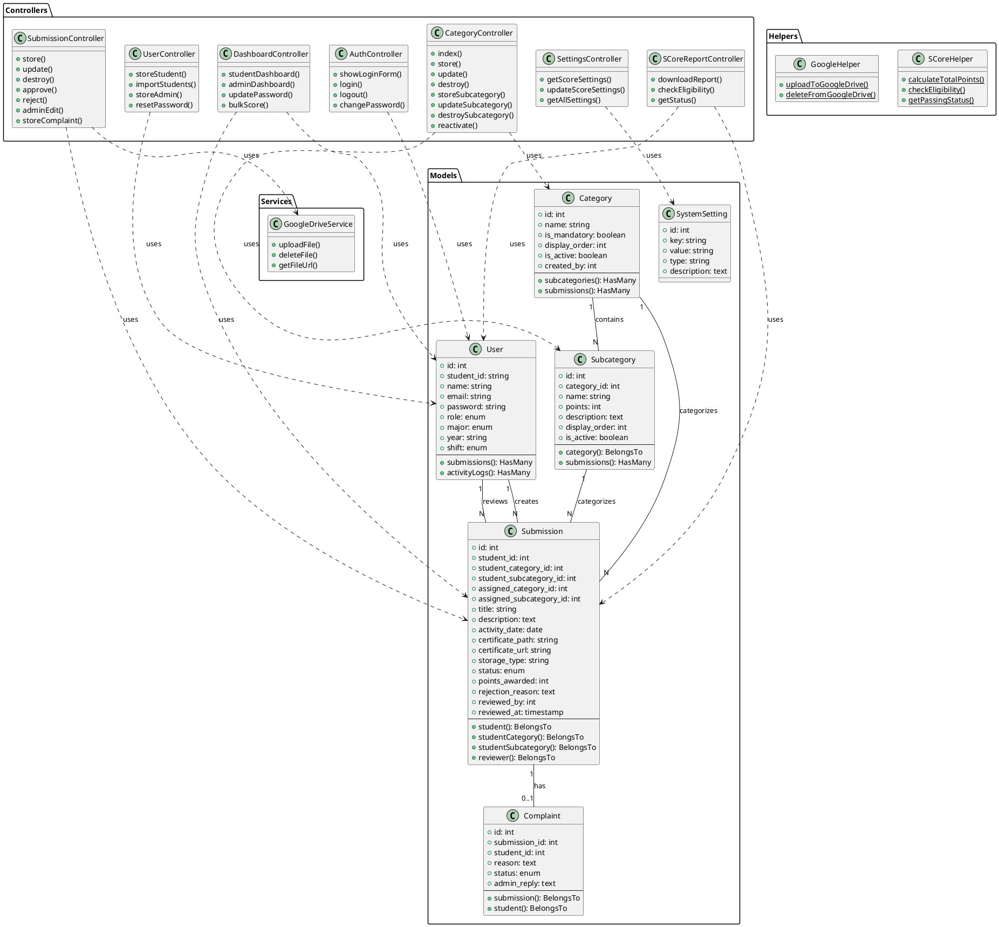

# UML Documentation - S-Core ITBSS System
## Student Point Management & Certification Tracking System

---

## 1. ERD (Entity Relationship Diagram)

```
┌─────────────────────────────────────────┐
│              USERS                       │
├─────────────────────────────────────────┤
│ PK  id                                   │
│     student_id (NIM) UNIQUE             │
│     name                                 │
│     email UNIQUE                         │
│     password                             │
│     role (student/admin)                │
│     major (STI/BD/KWU)                  │
│     year (Angkatan)                     │
│     shift (Pagi/Sore)                   │
│     email_verified_at                    │
│     remember_token                       │
│     created_at, updated_at              │
└─────────────────────────────────────────┘
           │                    │
           │                    │
           │ 1                  │ 1
           │                    │
           │ N                  │ N
           ▼                    ▼
┌─────────────────────┐   ┌──────────────────────┐
│   SUBMISSIONS       │   │   ACTIVITY_LOGS      │
├─────────────────────┤   ├──────────────────────┤
│ PK  id              │   │ PK  id               │
│ FK  student_id      │───│ FK  user_id          │
│ FK  student_cat_id  │   │     action           │
│ FK  student_sub_id  │   │     entity_type      │
│ FK  assigned_cat_id │   │     entity_id        │
│ FK  assigned_sub_id │   │     details          │
│     title           │   │     ip_address       │
│     description     │   │     user_agent       │
│     activity_date   │   │     created_at       │
│     certificate_*   │   └──────────────────────┘
│     storage_type    │
│     certificate_url │
│     status          │
│     points_awarded  │
│     rejection_*     │
│ FK  reviewed_by     │
│     reviewed_at     │
│     submitted_at    │
│     created_at      │
│     updated_at      │
└─────────────────────┘
     │         │
     │ N       │ N
     │ 1       │ 1
     ▼         ▼
┌──────────────┐   ┌──────────────────┐
│  CATEGORIES  │   │  SUBCATEGORIES   │
├──────────────┤   ├──────────────────┤
│ PK  id       │   │ PK  id           │
│     name     │───│ FK  category_id  │
│  is_mandatory│ 1 │     name         │
│ display_order│   │     points       │
│  is_active   │ N │     description  │
│ FK created_by│   │  display_order   │
│  created_at  │   │  is_active       │
│  updated_at  │   │  created_at      │
└──────────────┘   │  updated_at      │
                   └──────────────────┘

┌──────────────────────┐   ┌──────────────────┐
│  SYSTEM_SETTINGS     │   │   COMPLAINTS     │
├──────────────────────┤   ├──────────────────┤
│ PK  id               │   │ PK  id           │
│     key              │   │ FK  submission_id│
│     value            │   │ FK  student_id   │
│     type             │   │     reason       │
│     description      │   │     status       │
│     created_at       │   │     admin_reply  │
│     updated_at       │   │     created_at   │
└──────────────────────┘   │     updated_at   │
                           └──────────────────┘
```

---

## 2. Use Case Diagram

### Actors:
- **Student (Mahasiswa)**
- **Admin**
- **System**

```
                    ┌───────────────────────────────────┐
                    │       S-Core ITBSS System         │
                    └───────────────────────────────────┘
                                    │
        ┌───────────────────────────┼───────────────────────────┐
        │                           │                           │
  ┌─────▼──────┐            ┌──────▼──────┐           ┌───────▼──────┐
  │  STUDENT   │            │    ADMIN    │           │   SYSTEM     │
  └────────────┘            └─────────────┘           └──────────────┘
        │                           │                           │
        │                           │                           │
        ├─ Login                    ├─ Login                   ├─ Auto Backup
        │                           │                           │
        ├─ View Dashboard           ├─ View Dashboard          ├─ Send Email
        │  • Total Points           │  • Statistics             │   Notifications
        │  • Status (Pass/Fail)     │  • Submissions Count      │
        │  • Activity History       │  • Student Stats          ├─ Generate Reports
        │                           │                           │
        ├─ Submit Activity          ├─ Review Submissions      ├─ Store Files to
        │  • Choose Category        │  • Approve                │   Google Drive
        │  • Upload Certificate     │  • Reject                 │
        │  • Fill Details           │  • Edit Category          ├─ Activity Logging
        │                           │  • Change Points          │
        ├─ Edit Submission          │                           └─ Validate Data
        │  (Waiting/Rejected)       ├─ Manage Users               Integrity
        │                           │  • Add Student            
        ├─ Delete Submission        │  • Import CSV             
        │  (Waiting/Rejected)       │  • Add Admin              
        │                           │  • Reset Password         
        ├─ View Activity Details    │                           
        │  • Read Certificate       ├─ Manage Categories        
        │  • See Points              │  • Create Category       
        │  • Check Status            │  • Edit Category         
        │                           │  • Delete Category        
        ├─ File Complaint           │  • Activate/Deactivate    
        │  (Approved/Rejected)       │                           
        │                           ├─ Bulk Score Assignment    
        ├─ Change Password          │  • Filter Students        
        │                           │  • Assign Points          
        ├─ Download S-Core Report   │  • Upload Certificate     
        │  (if eligible)             │                           
        │                           ├─ Student Management       
        └─ Logout                   │  • View Details           
                                    │  • Reset Password         
                                    │  • Download Report        
                                    │                           
                                    ├─ System Settings         
                                    │  • Min Points             
                                    │  • Min Categories         
                                    │                           
                                    ├─ View Activity Logs      
                                    │                           
                                    └─ Logout                  
```

---

## 3. Class Diagram



---

## 4. Sequence Diagram - Student Submit Activity

```
Student          Dashboard        SubmissionCtrl    GoogleDrive      Database
  │                  │                  │               │               │
  ├─ Click "Add" ───>│                  │               │               │
  │                  │                  │               │               │
  │<──Show Modal─────┤                  │               │               │
  │                  │                  │               │               │
  ├─ Fill Form ──────>│                  │               │               │
  ├─ Upload PDF ─────>│                  │               │               │
  ├─ Click Submit ───>│                  │               │               │
  │                  │                  │               │               │
  │                  ├─ POST /submissions│               │               │
  │                  │                  │               │               │
  │                  │                  ├─ Validate ───>│               │
  │                  │                  │               │               │
  │                  │                  ├─ uploadFile() ────>           │
  │                  │                  │               │               │
  │                  │                  │<─── File URL ─────┤           │
  │                  │                  │               │               │
  │                  │                  ├────── Create Submission ───>  │
  │                  │                  │               │               │
  │                  │                  │<───────── Success ────────────┤
  │                  │                  │               │               │
  │                  │<── 200 OK ───────┤               │               │
  │                  │                  │               │               │
  │<── Success Alert ┤                  │               │               │
  │                  │                  │               │               │
  ├─ Reload Page ────>│                  │               │               │
  │                  │                  │               │               │
```

---

## 5. Sequence Diagram - Admin Review Submission

```
Admin            Dashboard        SubmissionCtrl    Database       Email
  │                  │                  │               │             │
  ├─ View List ─────>│                  │               │             │
  │                  │                  │               │             │
  │<── Show List ────┤                  │               │             │
  │                  │                  │               │             │
  ├─ Click Review ───>│                  │               │             │
  │                  │                  │               │             │
  │<── Show Modal ───┤                  │               │             │
  │                  │                  │               │             │
  ├─ Click Approve ──>│                  │               │             │
  │                  │                  │               │             │
  │                  ├─ POST /approve ─>│               │             │
  │                  │                  │               │             │
  │                  │                  ├─ Update Status "Approved" ─>│
  │                  │                  ├─ Set points_awarded ────────>│
  │                  │                  ├─ Set reviewed_by ───────────>│
  │                  │                  │               │             │
  │                  │                  │<──── Success ────────────────┤
  │                  │                  │               │             │
  │                  │                  ├────── Send Email ─────────────>│
  │                  │                  │               │             │
  │                  │<── 200 OK ───────┤               │             │
  │                  │                  │               │             │
  │<── Success Alert ┤                  │               │             │
  │                  │                  │               │             │
```

---

## 6. Activity Diagram - Submission Review Process

```
                    ┌──────────────┐
                    │   START      │
                    └──────┬───────┘
                           │
                           ▼
                    ┌──────────────┐
                    │ Admin Login  │
                    └──────┬───────┘
                           │
                           ▼
                    ┌──────────────────┐
                    │ View Submissions │
                    │ (Status=Waiting) │
                    └──────┬───────────┘
                           │
                           ▼
                    ┌──────────────────┐
                    │ Select Submission│
                    └──────┬───────────┘
                           │
                           ▼
                    ┌──────────────────┐
                    │ View Details     │
                    │ • Student Info   │
                    │ • Certificate    │
                    │ • Activity Data  │
                    └──────┬───────────┘
                           │
                           ▼
                ┌──────────┴──────────┐
                │                     │
                ▼                     ▼
         ┌─────────────┐      ┌─────────────┐
         │   APPROVE   │      │   REJECT    │
         └──────┬──────┘      └──────┬──────┘
                │                     │
                │                     ▼
                │              ┌──────────────┐
                │              │ Enter Reason │
                │              └──────┬───────┘
                │                     │
                │                     │
                ▼                     ▼
         ┌──────────────────────────────────┐
         │   Update Submission Status       │
         │   • Set Status                   │
         │   • Award Points (if approved)   │
         │   • Set Reviewer Info            │
         │   • Save Reason (if rejected)    │
         └──────────────┬───────────────────┘
                        │
                        ▼
                 ┌──────────────┐
                 │ Log Activity │
                 └──────┬───────┘
                        │
                        ▼
                 ┌──────────────┐
                 │ Send Email   │
                 │ Notification │
                 └──────┬───────┘
                        │
                        ▼
                 ┌──────────────┐
                 │    END       │
                 └──────────────┘
```

---

## 7. State Diagram - Submission Status

```
                           ┌─────────┐
                           │ Created │
                           └────┬────┘
                                │
                                │ Student submits
                                │
                                ▼
                          ┌──────────┐
                          │ Waiting  │◄──────────┐
                          └────┬─────┘           │
                               │                 │
                               │                 │ Student edits
                ┌──────────────┼──────────────┐  │ (from Rejected)
                │              │              │  │
     Admin      │              │              │  │
     approves   │              │   Admin      │  │
                │              │   rejects    │  │
                ▼              │              ▼  │
          ┌──────────┐         │        ┌──────────┐
          │ Approved │         │        │ Rejected │─┘
          └────┬─────┘         │        └──────────┘
               │               │              │
               │               │              │ Student can:
               │               │              │ • Edit & resubmit
               │               │              │ • Delete
               │               │              │ • File complaint
               │               │              │
               │               │ Student      │
               │               │ cancels      │
               │               │              │
               │               ▼              │
               │         ┌──────────┐         │
               │         │  Cancel  │         │
               │         └──────────┘         │
               │                              │
               │                              │
               │         ┌──────────────────┐ │
               └────────>│ [Final States]   │◄┘
                         │ • Report          │
                         │   Generated       │
                         │ • Certificate     │
                         │   Archived        │
                         └──────────────────┘
```

---

## 8. Component Diagram

```
┌───────────────────────────────────────────────────────────┐
│                   S-Core ITBSS System                      │
├───────────────────────────────────────────────────────────┤
│                                                            │
│  ┌─────────────────┐         ┌─────────────────┐         │
│  │  Presentation   │         │   Application    │         │
│  │     Layer       │────────>│     Layer        │         │
│  ├─────────────────┤         ├─────────────────┤         │
│  │ • dashboard.    │         │ • Controllers    │         │
│  │   blade.php     │         │ • Middleware     │         │
│  │ • admin_review. │         │ • Requests       │         │
│  │   blade.php     │         │ • Form          │         │
│  │ • login.blade.  │         │   Validation     │         │
│  │   php           │         │                  │         │
│  │ • Alpine.js     │         │                  │         │
│  │ • TailwindCSS   │         │                  │         │
│  └─────────────────┘         └────────┬─────────┘         │
│                                       │                    │
│                                       ▼                    │
│                              ┌─────────────────┐          │
│                              │   Domain Layer  │          │
│                              ├─────────────────┤          │
│                              │ • Models        │          │
│                              │ • Services      │          │
│                              │ • Helpers       │          │
│                              │ • Business      │          │
│                              │   Logic         │          │
│                              └────────┬────────┘          │
│                                       │                    │
│                                       ▼                    │
│  ┌─────────────────┐         ┌─────────────────┐         │
│  │ Infrastructure  │         │  External APIs   │         │
│  │     Layer       │         │                  │         │
│  ├─────────────────┤         ├─────────────────┤         │
│  │ • Database      │         │ • Google Drive  │         │
│  │   (MySQL)       │         │   API            │         │
│  │ • File Storage  │<────────│ • Email Service │         │
│  │ • Queue Jobs    │         │   (SMTP)         │         │
│  │ • Cache         │         │                  │         │
│  │ • Session       │         │                  │         │
│  └─────────────────┘         └─────────────────┘         │
│                                                            │
└───────────────────────────────────────────────────────────┘
```

---

## 9. Deployment Diagram

```
┌──────────────────────────────────────────────────────────┐
│                    Client Browser                         │
│  ┌────────────────────────────────────────┐              │
│  │  HTML/CSS/JavaScript (Alpine.js)       │              │
│  └────────────────────────────────────────┘              │
└────────────────────┬─────────────────────────────────────┘
                     │ HTTPS
                     │
                     ▼
┌──────────────────────────────────────────────────────────┐
│              Web Server (XAMPP/Apache)                    │
│  ┌────────────────────────────────────────┐              │
│  │         Laravel Application            │              │
│  │  ┌────────────────────────────────┐   │              │
│  │  │  • Routes                      │   │              │
│  │  │  • Controllers                 │   │              │
│  │  │  • Middleware                  │   │              │
│  │  │  • Views (Blade Templates)     │   │              │
│  │  └────────────────────────────────┘   │              │
│  └────────────────────────────────────────┘              │
└────────┬──────────────────────┬────────────────────┬─────┘
         │                      │                    │
         │ PDO                  │ File I/O           │ API Call
         │                      │                    │
         ▼                      ▼                    ▼
┌─────────────────┐   ┌──────────────────┐  ┌────────────────┐
│  MySQL Database │   │  File Storage    │  │ Google Drive   │
│  ┌───────────┐  │   │  ┌───────────┐   │  │  API Service   │
│  │• users    │  │   │  │• uploads/ │   │  │                │
│  │• categories│ │   │  │• temp/    │   │  │  ┌──────────┐  │
│  │• submissions│ │   │  │• logs/    │   │  │  │ Storage  │  │
│  │• activity_│  │   │  └───────────┘   │  │  │ Bucket   │  │
│  │  logs     │  │   │                  │  │  └──────────┘  │
│  └───────────┘  │   └──────────────────┘  └────────────────┘
└─────────────────┘
```

---

## 10. System Architecture Overview

### Technology Stack:
- **Frontend**: Blade Templates, Alpine.js, TailwindCSS
- **Backend**: Laravel 11, PHP 8.2+
- **Database**: MySQL 8.0
- **File Storage**: Google Drive API
- **Web Server**: Apache (XAMPP)
- **Authentication**: Laravel Breeze/Sanctum
- **Queue**: Database Driver
- **Cache**: File Driver

### Key Features:
1. **Authentication & Authorization**
   - Role-based access (Student/Admin)
   - Session management
   - Password reset

2. **Submission Management**
   - CRUD operations
   - File upload to Google Drive
   - Status tracking (Waiting/Approved/Rejected)

3. **Category Management**
   - Hierarchical categories (Main → Sub)
   - Points assignment per subcategory
   - Active/inactive status

4. **Review System**
   - Admin approval workflow
   - Rejection with reasons
   - Category reassignment
   - Point adjustment

5. **Reporting**
   - S-Core eligibility check
   - PDF report generation
   - Student statistics

6. **User Management**
   - Student registration
   - CSV import
   - Admin account creation
   - Password reset

7. **Activity Logging**
   - All user actions tracked
   - Audit trail for compliance

8. **Bulk Operations**
   - Bulk score assignment
   - Filter by major/year/shift

---

## 11. Database Relationships Summary

```
users (1) ──────< submissions (N)
users (1) ──────< activity_logs (N)
users (1) ──────< complaints (N)
users (1) ──────< categories (N) [created_by]

categories (1) ──< subcategories (N)
categories (1) ──< submissions (N) [student_category_id]
categories (1) ──< submissions (N) [assigned_category_id]

subcategories (1) < submissions (N) [student_subcategory_id]
subcategories (1) < submissions (N) [assigned_subcategory_id]

submissions (1) ─< complaints (N)
```

---

## 12. API Endpoints Structure

### Authentication
- `POST /login` - Login
- `POST /logout` - Logout
- `POST /change-password` - Change password

### Dashboard
- `GET /dashboard` - Student dashboard
- `GET /admin` - Admin dashboard

### Submissions (Student)
- `POST /submissions` - Create submission
- `PUT /submissions/{id}` - Update submission
- `DELETE /submissions/{id}` - Delete submission
- `POST /submissions/complaint` - File complaint

### Submissions (Admin)
- `POST /admin/submissions/{id}/approve` - Approve
- `POST /admin/submissions/{id}/reject` - Reject
- `PUT /admin/submissions/{id}/edit` - Admin edit

### Users
- `POST /students/store` - Add student
- `POST /students/import` - Import CSV
- `POST /admins/store` - Add admin
- `POST /admin/users/{id}/reset-password` - Reset password

### Categories
- `GET /api/categories` - Get all categories
- `POST /admin/categories` - Create category
- `PUT /admin/categories/{id}` - Update category
- `DELETE /admin/categories/{id}` - Delete category
- `POST /admin/subcategories` - Create subcategory
- `PUT /admin/subcategories/{id}` - Update subcategory
- `DELETE /admin/subcategories/{id}` - Delete subcategory

### Settings
- `GET /api/settings/score` - Get score settings
- `POST /admin/settings/score` - Update settings

### Reports
- `GET /student/{id}/report` - Download report
- `GET /student/{id}/report/check` - Check eligibility
- `GET /student/{id}/status` - Get status

---

## 13. Security Considerations

1. **Authentication**
   - Password hashing (bcrypt)
   - CSRF protection
   - Session management

2. **Authorization**
   - Role-based access control
   - Route middleware protection
   - Resource ownership validation

3. **Data Validation**
   - Form request validation
   - File type validation
   - File size limits (10MB)

4. **File Security**
   - Google Drive integration
   - Secure file URLs
   - Access control

5. **SQL Injection Prevention**
   - Eloquent ORM
   - Prepared statements
   - Input sanitization

6. **XSS Prevention**
   - Blade template escaping
   - Content Security Policy

---

**Document Version**: 1.0  
**Last Updated**: January 9, 2026  
**Author**: System Analyst  
**Status**: Complete
